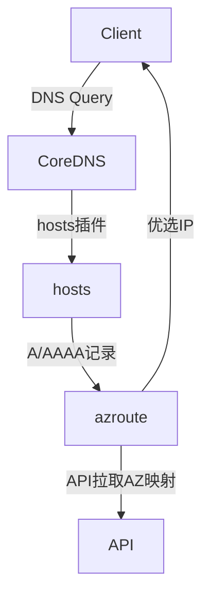
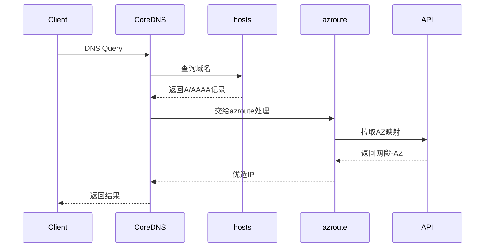

# azroute 插件设计文档

## 1. 设计目标
- 实现基于可用区（AZ）的 DNS 解析就近调度。
- 用户只需维护 hosts 文件，AZ 信息自动感知。
- 支持 API 动态热加载网段-AZ 映射。
- 支持 IPv4/IPv6，A/AAAA 记录。

## 2. 架构与流程

- hosts 插件负责域名到 IP 的静态解析。
- azroute 插件负责根据客户端 IP 匹配 AZ，并对 hosts 返回的 IP 进行 AZ 优选。
- azroute 插件定时从 API 拉取网段-AZ 映射，支持热加载。

## 3. 关键流程
1. CoreDNS 收到 DNS 查询。
2. hosts 插件返回所有匹配的 IP。
3. azroute 插件根据客户端 IP 匹配 AZ。
4. azroute 插件优先返回同 AZ 的 IP，否则返回全部。
5. 若 API 不可用，使用上次缓存。

## 4. 扩展点
- 支持多 API 源、缓存优化。
- 支持自定义调度策略（如权重、健康检查等）。
- 支持更多类型的 DNS 记录。

## 5. 主要结构
- AzRoute：插件主结构体，维护 AZ 映射、API 地址等。
- findAZ：根据 IP 匹配 AZ。
- ServeDNS：主处理逻辑，捕获 hosts 返回的 IP 并优选。
- fetchAzMap：定时拉取 API，热加载数据。

## 6. 典型时序图
